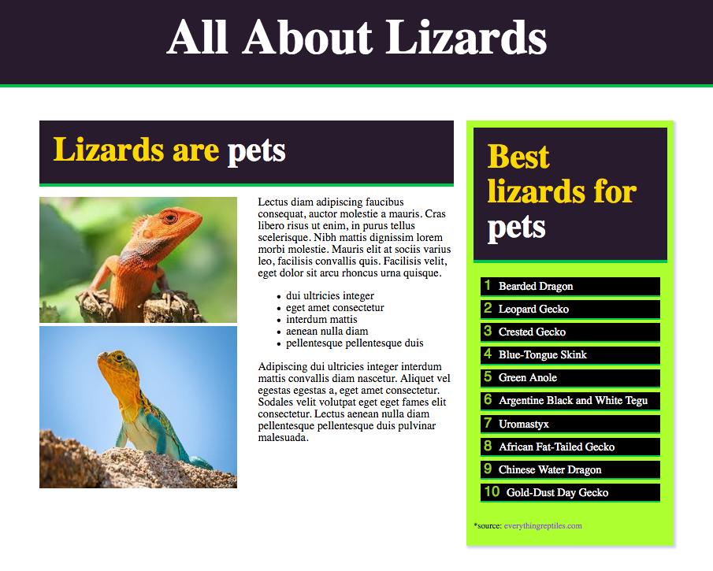

# Scrimba - HTML & CSS Challenges- All about lizards webpage

This is a solution to the HTML & CSS challenges.

## Table of contents

- [Screenshot](#screenshot)
- [Links](#links)
- [Built with](#built-with)
- [What I learned](#what-i-learned)

### Screenshot

### Links

- Live Site URL: [https://tanhyab.github.io/all-about-lizards-webpage/](https://your-live-site-url.com)

### Built with

- Semantic HTML5 markup
- CSS
- Flexbox
- Styling lists

### What I learned

- Semantic HTML5 markup
- CSS
- Pseudo elements
- Flexbox
- Styling lists
